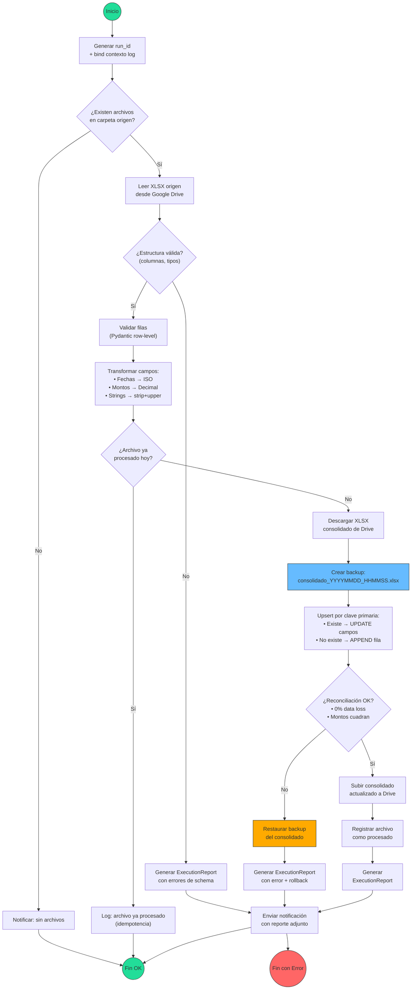

# Arquitectura Técnica v2: ETL Simplificado — Consolidación de Facturas XLSX

> Rediseño enfocado: XLSX Origen (Google Drive) → XLSX Consolidado (Google Drive)
> Sin RPA. Sin sistemas externos. Solo traspaso estructurado con validación.
> Última actualización: 2026-02-11

---

## 0. Qué cambió respecto a v1

| Concepto v1 (Ecosistema completo) | v2 (ETL Simplificado) | Razón |
|---|---|---|
| RPA Playwright + iTrade | **Eliminado** | No hay integración con sistemas web |
| PurchaseOrder, Shipment, Pallet | **Eliminado** | Fuera de alcance |
| Page Object Model | **Eliminado** | Sin browser |
| Weekly Report, Pallet Tags | **Eliminado** | Fuera de alcance |
| 6 use cases | **1 use case** | Solo consolidación XLSX→XLSX |
| 8 ports/interfaces | **3 ports** | DriveRepository, ExcelHandler, Notifier |
| Session management, auth state | **Eliminado** | Google Drive via service account |
| Carrier factory + strategies | **Simplificado** | Un solo schema configurable |
| `Decimal` financiero | **Mantenido** | Crítico para montos |
| Reconciliation Report | **Mantenido + simplificado** | Trazabilidad obligatoria |
| Logging estructurado | **Mantenido** | Observabilidad no es negociable |
| Idempotencia | **Adaptada** | Hash de archivo fuente |
| Docker | **Mantenido** | Despliegue reproducible |

---

## 1. Diagrama de Flujo



---

## 2. Arquitectura por Capas

### 2.1 Vista general

```
┌──────────────────────────────────────────────────────┐
│                    Orchestrator                       │
│         (scripts/run_consolidation.py)                │
│  Coordina el flujo completo. Entry point único.      │
└───────────────────────┬──────────────────────────────┘
                        │ invoca
┌───────────────────────▼──────────────────────────────┐
│                  Application Layer                    │
│          ConsolidateInvoicesUseCase                   │
│  Orquesta: extract → validate → transform →          │
│            upsert → reconcile → report               │
└───────────┬───────────┬──────────────┬───────────────┘
            │           │              │
     usa ports:    usa ports:     usa ports:
            │           │              │
┌───────────▼──┐ ┌──────▼──────┐ ┌─────▼──────────┐
│ DriveRepo    │ │ ExcelHandler│ │ Notifier        │
│ (Protocol)   │ │ (Protocol)  │ │ (Protocol)      │
└───────┬──────┘ └──────┬──────┘ └──────┬──────────┘
        │               │               │
┌───────▼──────────────▼───────────────▼───────────┐
│               Infrastructure Layer                │
│  GoogleDriveAdapter  OpenpyxlHandler  SmtpSender │
└──────────────────────────────────────────────────┘
```

### 2.2 Responsabilidades por capa

| Capa | Responsabilidad | NO hace |
|------|----------------|---------|
| **Domain** | Entidades (`InvoiceRecord`), value objects (`Money`), reglas de validación puras, excepciones de negocio | I/O, logging, frameworks |
| **Application** | Use case único, definición de ports (Protocol), DTOs, lógica de upsert, reconciliación | Leer/escribir archivos directamente |
| **Infrastructure** | Google Drive API, openpyxl, SMTP, logging con structlog | Reglas de negocio |
| **Orchestrator** | Wiring de dependencias, entry point, manejo de señales | Lógica de negocio |

---

## 3. Entidades de Dominio

```python
# src/domain/entities.py
from dataclasses import dataclass, field
from datetime import date, datetime
from decimal import Decimal, InvalidOperation
from enum import Enum
from typing import Optional


class RecordStatus(Enum):
    """Estado de un registro durante el procesamiento."""
    NEW = "new"              # No existe en consolidado → se agregará
    UPDATED = "updated"      # Existe en consolidado → se actualizará
    UNCHANGED = "unchanged"  # Existe y no tiene cambios
    ERROR = "error"          # Falló validación


@dataclass(frozen=True, kw_only=True)
class InvoiceRecord:
    """
    Entidad central: una fila de factura de transporte.

    Representa tanto filas del archivo origen como del consolidado.
    Inmutable — las transformaciones crean nuevas instancias.
    """
    # === Clave primaria compuesta ===
    invoice_number: str
    reference_number: str    # N° Guía / BL / Booking

    # === Campos de negocio ===
    carrier_name: str
    invoice_date: date
    description: str
    net_amount: Decimal
    tax_amount: Decimal
    total_amount: Decimal
    currency: str = "CLP"

    # === Metadatos de procesamiento (no son clave primaria) ===
    source_file: Optional[str] = None
    processed_at: Optional[datetime] = None
    status: RecordStatus = RecordStatus.NEW

    def __post_init__(self):
        """Validaciones de invariantes de dominio."""
        if not self.invoice_number or not self.invoice_number.strip():
            raise ValueError("invoice_number no puede estar vacío")
        if not self.reference_number or not self.reference_number.strip():
            raise ValueError("reference_number no puede estar vacío")
        if self.total_amount < 0:
            raise ValueError(f"total_amount no puede ser negativo: {self.total_amount}")
        # Validación cruzada: total ≈ net + tax
        expected = self.net_amount + self.tax_amount
        if abs(self.total_amount - expected) > Decimal("1"):
            raise ValueError(
                f"total_amount ({self.total_amount}) no coincide con "
                f"net ({self.net_amount}) + tax ({self.tax_amount}) = {expected}"
            )

    @property
    def primary_key(self) -> tuple[str, str]:
        """Clave compuesta para matching en upsert."""
        return (self.invoice_number.strip(), self.reference_number.strip())

    def with_status(self, new_status: RecordStatus) -> "InvoiceRecord":
        """Retorna copia con status actualizado."""
        return InvoiceRecord(
            invoice_number=self.invoice_number,
            reference_number=self.reference_number,
            carrier_name=self.carrier_name,
            invoice_date=self.invoice_date,
            description=self.description,
            net_amount=self.net_amount,
            tax_amount=self.tax_amount,
            total_amount=self.total_amount,
            currency=self.currency,
            source_file=self.source_file,
            processed_at=self.processed_at,
            status=new_status,
        )

    def has_changes_vs(self, other: "InvoiceRecord") -> bool:
        """Compara campos de negocio (ignora metadatos)."""
        return (
            self.carrier_name != other.carrier_name
            or self.invoice_date != other.invoice_date
            or self.net_amount != other.net_amount
            or self.tax_amount != other.tax_amount
            or self.total_amount != other.total_amount
        )
```

```python
# src/domain/value_objects.py
from dataclasses import dataclass
from decimal import Decimal, InvalidOperation


@dataclass(frozen=True)
class Money:
    """Value object para montos financieros. Siempre Decimal, nunca float."""
    amount: Decimal
    currency: str = "CLP"

    def __post_init__(self):
        if not isinstance(self.amount, Decimal):
            try:
                object.__setattr__(self, "amount", Decimal(str(self.amount)))
            except (InvalidOperation, ValueError) as e:
                raise ValueError(f"Monto inválido: {self.amount}") from e

    def __add__(self, other: "Money") -> "Money":
        if self.currency != other.currency:
            raise ValueError(f"No se puede sumar {self.currency} con {other.currency}")
        return Money(amount=self.amount + other.amount, currency=self.currency)
```

```python
# src/domain/exceptions.py

class ConsolidationError(Exception):
    """Base para errores del proceso de consolidación."""
    pass


class SourceFileNotFoundError(ConsolidationError):
    """No se encontraron archivos en la carpeta origen."""
    pass


class SchemaValidationError(ConsolidationError):
    """El archivo origen no tiene la estructura esperada."""
    def __init__(self, missing_columns: list[str], extra_columns: list[str]):
        self.missing_columns = missing_columns
        self.extra_columns = extra_columns
        super().__init__(
            f"Columnas faltantes: {missing_columns}, inesperadas: {extra_columns}"
        )


class RowValidationError(ConsolidationError):
    """Una o más filas no pasaron validación."""
    def __init__(self, errors: list[dict]):
        self.errors = errors
        super().__init__(f"{len(errors)} filas con errores de validación")


class ReconciliationError(ConsolidationError):
    """La reconciliación post-upsert detectó discrepancias críticas."""
    def __init__(self, data_loss_pct: float, amount_variance: Decimal):
        self.data_loss_pct = data_loss_pct
        self.amount_variance = amount_variance
        super().__init__(
            f"Reconciliación fallida: data_loss={data_loss_pct:.2f}%, "
            f"amount_variance={amount_variance}"
        )


class RollbackExecutedError(ConsolidationError):
    """Se ejecutó rollback tras fallo en actualización."""
    def __init__(self, reason: str, backup_path: str):
        self.reason = reason
        self.backup_path = backup_path
        super().__init__(f"Rollback ejecutado: {reason}. Backup: {backup_path}")


class IdempotencySkipError(ConsolidationError):
    """Archivo ya procesado (check de idempotencia)."""
    pass
```

---

## 4. Contratos entre Capas (Ports)

Tres interfaces. Nada más.

```python
# src/application/ports/drive_repository.py
from typing import Protocol
from pathlib import Path


class DriveRepository(Protocol):
    """Puerto: operaciones contra Google Drive."""

    def list_source_files(self, folder_id: str) -> list[dict]:
        """
        Lista archivos XLSX en la carpeta origen.
        Retorna: [{"file_id": "...", "name": "...", "modified_time": "..."}]
        """
        ...

    def download_file(self, file_id: str, local_path: Path) -> Path:
        """Descarga archivo de Drive a ruta local. Retorna la ruta."""
        ...

    def upload_file(self, local_path: Path, folder_id: str, file_name: str) -> str:
        """Sube archivo a Drive. Retorna file_id del archivo subido."""
        ...

    def create_backup(self, file_id: str, backup_name: str) -> str:
        """Crea copia del archivo en Drive. Retorna file_id del backup."""
        ...

    def restore_backup(self, backup_file_id: str, original_file_id: str) -> None:
        """Restaura backup sobre el archivo original."""
        ...

    def update_file(self, file_id: str, local_path: Path) -> None:
        """Reemplaza contenido de archivo existente en Drive."""
        ...
```

```python
# src/application/ports/excel_handler.py
from typing import Protocol
from pathlib import Path
import pandas as pd


class ExcelReader(Protocol):
    """Puerto: lectura de archivos Excel."""

    def read(self, file_path: Path, sheet_name: str = "Sheet1") -> pd.DataFrame:
        """Lee XLSX y retorna DataFrame crudo."""
        ...

    def validate_schema(
        self, df: pd.DataFrame, expected_columns: list[str]
    ) -> tuple[bool, list[str], list[str]]:
        """
        Valida que el DataFrame tenga las columnas esperadas.
        Retorna: (is_valid, missing_columns, extra_columns)
        """
        ...


class ExcelWriter(Protocol):
    """Puerto: escritura de archivos Excel."""

    def write(self, df: pd.DataFrame, file_path: Path, sheet_name: str = "Sheet1") -> None:
        """Escribe DataFrame a XLSX."""
        ...
```

```python
# src/application/ports/notifier.py
from typing import Protocol
from pathlib import Path


class Notifier(Protocol):
    """Puerto: notificaciones del resultado de ejecución."""

    def send(
        self,
        subject: str,
        body: str,
        recipients: list[str],
        attachments: list[Path] | None = None,
    ) -> None:
        """Envía notificación con reporte adjunto opcional."""
        ...
```

**¿Por qué solo 3 ports?**
El sistema anterior tenía 8 ports porque interactuaba con iTrade (RPA), múltiples módulos de reporting, y generación documental. Este sistema solo tiene 3 responsabilidades de I/O: leer/escribir Drive, leer/escribir Excel, y notificar. Agregar más ports sin necesidad viola YAGNI y agrega indirección sin valor.

---

## 5. Use Case Único

```python
# src/application/use_cases/consolidate_invoices.py
from dataclasses import dataclass, field
from datetime import datetime
from decimal import Decimal
from pathlib import Path
from typing import Optional

from src.domain.entities import InvoiceRecord, RecordStatus
from src.domain.exceptions import (
    IdempotencySkipError,
    ReconciliationError,
    RollbackExecutedError,
    SchemaValidationError,
    SourceFileNotFoundError,
)
from src.application.ports.drive_repository import DriveRepository
from src.application.ports.excel_handler import ExcelReader, ExcelWriter
from src.application.ports.notifier import Notifier
from src.application.dtos import ConsolidationConfig, ExecutionReport, UpsertResult


@dataclass(frozen=True)
class ConsolidateInvoicesUseCase:
    """
    Caso de uso único: Consolidar facturas desde XLSX origen a XLSX destino.

    Flujo:
    1. Verificar existencia de archivos origen
    2. Descargar y leer XLSX origen
    3. Validar schema + filas
    4. Transformar campos
    5. Descargar consolidado actual
    6. Backup del consolidado
    7. Upsert por clave primaria
    8. Reconciliar
    9. Subir consolidado actualizado (o rollback si falla)
    10. Generar y enviar reporte
    """
    drive: DriveRepository
    reader: ExcelReader
    writer: ExcelWriter
    notifier: Notifier
    config: ConsolidationConfig

    def execute(self) -> ExecutionReport:
        """Ejecuta el flujo completo. Retorna siempre un ExecutionReport."""
        run_id = f"consolidation-{datetime.utcnow().strftime('%Y%m%d-%H%M%S')}"
        report = ExecutionReport(run_id=run_id)
        backup_file_id: Optional[str] = None

        try:
            # 1. Listar archivos origen
            source_files = self.drive.list_source_files(self.config.source_folder_id)
            if not source_files:
                raise SourceFileNotFoundError("No hay archivos en carpeta origen")

            report.source_files = [f["name"] for f in source_files]

            for source_file in source_files:
                # 2. Descargar origen
                local_source = Path(f"/tmp/{source_file['name']}")
                self.drive.download_file(source_file["file_id"], local_source)

                # 3. Leer y validar schema
                df_source = self.reader.read(local_source, self.config.source_sheet)
                is_valid, missing, extra = self.reader.validate_schema(
                    df_source, self.config.expected_columns
                )
                if not is_valid:
                    raise SchemaValidationError(missing, extra)

                # 4. Validar filas + transformar
                source_records, validation_errors = self._validate_and_transform(
                    df_source, source_file["name"]
                )
                report.source_row_count += len(df_source)
                report.valid_row_count += len(source_records)
                report.validation_errors.extend(validation_errors)

                # 5. Check idempotencia
                if self._is_already_processed(source_file):
                    report.skipped_files.append(source_file["name"])
                    continue

                # 6. Descargar consolidado actual
                local_consolidated = Path("/tmp/consolidado.xlsx")
                self.drive.download_file(
                    self.config.consolidated_file_id, local_consolidated
                )
                df_consolidated = self.reader.read(
                    local_consolidated, self.config.consolidated_sheet
                )
                consolidated_records = self._dataframe_to_records(df_consolidated)

                # 7. Backup antes de modificar
                backup_file_id = self.drive.create_backup(
                    self.config.consolidated_file_id,
                    f"consolidado_backup_{run_id}.xlsx",
                )
                report.backup_file_id = backup_file_id

                # 8. Upsert
                upsert_result = self._upsert(consolidated_records, source_records)
                report.inserted_count = upsert_result.inserted
                report.updated_count = upsert_result.updated
                report.unchanged_count = upsert_result.unchanged

                # 9. Reconciliar ANTES de subir
                self._reconcile(report, source_records, upsert_result)

                # 10. Escribir y subir
                df_result = self._records_to_dataframe(upsert_result.all_records)
                self.writer.write(df_result, local_consolidated, self.config.consolidated_sheet)
                self.drive.update_file(
                    self.config.consolidated_file_id, local_consolidated
                )

                # 11. Marcar como procesado
                self._mark_as_processed(source_file)

            report.status = "SUCCESS"

        except SourceFileNotFoundError:
            report.status = "NO_FILES"
            report.message = "No se encontraron archivos en la carpeta origen"

        except IdempotencySkipError as e:
            report.status = "SKIPPED"
            report.message = str(e)

        except SchemaValidationError as e:
            report.status = "SCHEMA_ERROR"
            report.message = str(e)
            report.missing_columns = e.missing_columns

        except ReconciliationError as e:
            report.status = "RECONCILIATION_FAILED"
            report.message = str(e)
            # ROLLBACK
            if backup_file_id:
                self.drive.restore_backup(
                    backup_file_id, self.config.consolidated_file_id
                )
                report.rollback_executed = True

        except Exception as e:
            report.status = "ERROR"
            report.message = f"Error inesperado: {e}"
            # ROLLBACK
            if backup_file_id:
                self.drive.restore_backup(
                    backup_file_id, self.config.consolidated_file_id
                )
                report.rollback_executed = True

        finally:
            # Siempre notificar
            self._send_notification(report)

        return report

    # === Métodos privados ===

    def _validate_and_transform(
        self, df: "pd.DataFrame", source_name: str
    ) -> tuple[list[InvoiceRecord], list[dict]]:
        """Valida fila por fila y transforma campos."""
        from src.application.transformers import RowTransformer

        transformer = RowTransformer(self.config)
        records: list[InvoiceRecord] = []
        errors: list[dict] = []

        for idx, row in df.iterrows():
            try:
                record = transformer.transform_row(row, source_name)
                records.append(record)
            except Exception as e:
                errors.append({
                    "row_index": idx,
                    "error": str(e),
                    "row_data": {k: str(v) for k, v in row.items()},
                })

        return records, errors

    def _upsert(
        self,
        existing: list[InvoiceRecord],
        incoming: list[InvoiceRecord],
    ) -> UpsertResult:
        """
        Estrategia UPSERT:
        - Clave primaria: (invoice_number, reference_number)
        - Si existe y tiene cambios → UPDATE (incoming gana)
        - Si existe sin cambios → UNCHANGED
        - Si no existe → INSERT (append)
        """
        existing_map: dict[tuple, InvoiceRecord] = {
            r.primary_key: r for r in existing
        }

        result = UpsertResult()

        for record in incoming:
            pk = record.primary_key
            if pk in existing_map:
                old = existing_map[pk]
                if record.has_changes_vs(old):
                    # UPDATE: incoming reemplaza existing
                    existing_map[pk] = record.with_status(RecordStatus.UPDATED)
                    result.updated += 1
                else:
                    existing_map[pk] = old.with_status(RecordStatus.UNCHANGED)
                    result.unchanged += 1
            else:
                # INSERT
                existing_map[pk] = record.with_status(RecordStatus.NEW)
                result.inserted += 1

        result.all_records = list(existing_map.values())
        return result

    def _reconcile(
        self,
        report: ExecutionReport,
        source_records: list[InvoiceRecord],
        upsert_result: UpsertResult,
    ) -> None:
        """Valida 0% data loss y cuadre de montos."""
        # Todas las filas válidas del source deben estar en el resultado
        source_pks = {r.primary_key for r in source_records}
        result_pks = {r.primary_key for r in upsert_result.all_records}
        missing = source_pks - result_pks

        if missing:
            raise ReconciliationError(
                data_loss_pct=(len(missing) / len(source_pks)) * 100,
                amount_variance=Decimal("0"),
            )

        # Cuadre de montos: suma del source debe coincidir en el resultado
        source_total = sum(r.total_amount for r in source_records)
        result_subset = [
            r for r in upsert_result.all_records if r.primary_key in source_pks
        ]
        result_total = sum(r.total_amount for r in result_subset)

        variance = abs(source_total - result_total)
        if variance > Decimal("1"):  # Tolerancia de $1
            raise ReconciliationError(
                data_loss_pct=0,
                amount_variance=variance,
            )

        report.source_total_amount = source_total
        report.output_total_amount = result_total

    def _is_already_processed(self, source_file: dict) -> bool:
        """Check de idempotencia basado en manifest local."""
        import json
        manifest_path = Path(self.config.manifest_path)
        if not manifest_path.exists():
            return False
        manifest = json.loads(manifest_path.read_text())
        file_key = f"{source_file['name']}:{source_file['modified_time']}"
        return file_key in manifest.get("processed_files", [])

    def _mark_as_processed(self, source_file: dict) -> None:
        """Registra archivo como procesado en manifest."""
        import json
        manifest_path = Path(self.config.manifest_path)
        manifest = {"processed_files": []}
        if manifest_path.exists():
            manifest = json.loads(manifest_path.read_text())
        file_key = f"{source_file['name']}:{source_file['modified_time']}"
        manifest["processed_files"].append(file_key)
        manifest_path.write_text(json.dumps(manifest, indent=2))

    def _send_notification(self, report: ExecutionReport) -> None:
        """Envía reporte por email."""
        subject = f"[Smartbots ETL] {report.status} — {report.run_id}"
        body = report.to_text()
        report_path = Path(f"/tmp/report_{report.run_id}.json")
        report_path.write_text(report.to_json())

        self.notifier.send(
            subject=subject,
            body=body,
            recipients=self.config.notification_recipients,
            attachments=[report_path],
        )

    def _dataframe_to_records(self, df: "pd.DataFrame") -> list[InvoiceRecord]:
        """Convierte DataFrame existente a lista de InvoiceRecord."""
        from src.application.transformers import RowTransformer
        transformer = RowTransformer(self.config)
        records = []
        for _, row in df.iterrows():
            try:
                records.append(transformer.transform_row(row, source_name="consolidado"))
            except Exception:
                continue  # Filas legacy inválidas se preservan pero no se tocan
        return records

    def _records_to_dataframe(self, records: list[InvoiceRecord]) -> "pd.DataFrame":
        """Convierte lista de records a DataFrame para escritura."""
        import pandas as pd
        from dataclasses import asdict
        rows = []
        for r in records:
            d = asdict(r)
            d["invoice_date"] = r.invoice_date.isoformat()
            d["net_amount"] = float(r.net_amount)
            d["tax_amount"] = float(r.tax_amount)
            d["total_amount"] = float(r.total_amount)
            d.pop("status", None)
            d.pop("processed_at", None)
            rows.append(d)
        return pd.DataFrame(rows)
```

---

## 6. DTOs y Configuración

```python
# src/application/dtos.py
from dataclasses import dataclass, field
from datetime import datetime
from decimal import Decimal
from typing import Optional
import json

from src.domain.entities import InvoiceRecord


@dataclass
class ConsolidationConfig:
    """Configuración del proceso de consolidación."""
    # Google Drive IDs
    source_folder_id: str
    consolidated_file_id: str
    backup_folder_id: str

    # Estructura del Excel
    source_sheet: str = "Sheet1"
    consolidated_sheet: str = "Consolidado"
    expected_columns: list[str] = field(default_factory=lambda: [
        "N° Factura",
        "N° Referencia",
        "Transportista",
        "Fecha Factura",
        "Descripción",
        "Monto Neto",
        "IVA",
        "Monto Total",
        "Moneda",
    ])

    # Mapeo: nombre columna origen → nombre campo estándar
    column_mapping: dict[str, str] = field(default_factory=lambda: {
        "N° Factura": "invoice_number",
        "N° Referencia": "reference_number",
        "Transportista": "carrier_name",
        "Fecha Factura": "invoice_date",
        "Descripción": "description",
        "Monto Neto": "net_amount",
        "IVA": "tax_amount",
        "Monto Total": "total_amount",
        "Moneda": "currency",
    })

    # Idempotencia
    manifest_path: str = "data/processed_manifest.json"

    # Notificación
    notification_recipients: list[str] = field(default_factory=list)

    # Formatos
    date_format: str = "%d-%m-%Y"


@dataclass
class UpsertResult:
    """Resultado de la operación upsert."""
    inserted: int = 0
    updated: int = 0
    unchanged: int = 0
    all_records: list[InvoiceRecord] = field(default_factory=list)

    @property
    def total_processed(self) -> int:
        return self.inserted + self.updated + self.unchanged


@dataclass
class ExecutionReport:
    """Reporte de ejecución completo. Se genera SIEMPRE, incluso ante errores."""
    run_id: str
    timestamp: datetime = field(default_factory=datetime.utcnow)
    status: str = "PENDING"              # SUCCESS | ERROR | SCHEMA_ERROR | NO_FILES | SKIPPED
    message: str = ""

    # Archivos
    source_files: list[str] = field(default_factory=list)
    skipped_files: list[str] = field(default_factory=list)
    backup_file_id: Optional[str] = None
    rollback_executed: bool = False

    # Contadores
    source_row_count: int = 0
    valid_row_count: int = 0
    inserted_count: int = 0
    updated_count: int = 0
    unchanged_count: int = 0

    # Financiero
    source_total_amount: Decimal = Decimal("0")
    output_total_amount: Decimal = Decimal("0")

    # Errores
    validation_errors: list[dict] = field(default_factory=list)
    missing_columns: list[str] = field(default_factory=list)

    @property
    def amount_variance(self) -> Decimal:
        return abs(self.source_total_amount - self.output_total_amount)

    @property
    def has_errors(self) -> bool:
        return self.status not in ("SUCCESS", "NO_FILES", "SKIPPED")

    @property
    def data_loss_pct(self) -> float:
        if self.source_row_count == 0:
            return 0.0
        accounted = self.valid_row_count + len(self.validation_errors)
        if accounted != self.source_row_count:
            return ((self.source_row_count - accounted) / self.source_row_count) * 100
        return 0.0

    def to_text(self) -> str:
        """Representación legible para email."""
        lines = [
            f"═══ Execution Report: {self.run_id} ═══",
            f"Status:      {self.status}",
            f"Timestamp:   {self.timestamp.isoformat()}",
            f"Message:     {self.message or 'OK'}",
            "",
            "── Archivos ──",
            f"  Origen:    {', '.join(self.source_files) or 'ninguno'}",
            f"  Skipped:   {', '.join(self.skipped_files) or 'ninguno'}",
            f"  Backup ID: {self.backup_file_id or 'N/A'}",
            f"  Rollback:  {'SÍ ⚠️' if self.rollback_executed else 'No'}",
            "",
            "── Registros ──",
            f"  Origen:      {self.source_row_count}",
            f"  Válidos:     {self.valid_row_count}",
            f"  Insertados:  {self.inserted_count}",
            f"  Actualizados:{self.updated_count}",
            f"  Sin cambios: {self.unchanged_count}",
            f"  Errores val: {len(self.validation_errors)}",
            "",
            "── Financiero ──",
            f"  Total origen:  ${self.source_total_amount:,.0f}",
            f"  Total destino: ${self.output_total_amount:,.0f}",
            f"  Varianza:      ${self.amount_variance:,.0f}",
            f"  Data loss:     {self.data_loss_pct:.2f}%",
        ]

        if self.validation_errors:
            lines.append("")
            lines.append(f"── Errores de Validación ({len(self.validation_errors)}) ──")
            for err in self.validation_errors[:10]:  # Max 10 en texto
                lines.append(f"  Fila {err['row_index']}: {err['error']}")
            if len(self.validation_errors) > 10:
                lines.append(f"  ... y {len(self.validation_errors) - 10} más")

        return "\n".join(lines)

    def to_json(self) -> str:
        """Serialización completa para adjuntar al email."""
        return json.dumps({
            "run_id": self.run_id,
            "timestamp": self.timestamp.isoformat(),
            "status": self.status,
            "message": self.message,
            "source_files": self.source_files,
            "skipped_files": self.skipped_files,
            "backup_file_id": self.backup_file_id,
            "rollback_executed": self.rollback_executed,
            "source_row_count": self.source_row_count,
            "valid_row_count": self.valid_row_count,
            "inserted_count": self.inserted_count,
            "updated_count": self.updated_count,
            "unchanged_count": self.unchanged_count,
            "source_total_amount": str(self.source_total_amount),
            "output_total_amount": str(self.output_total_amount),
            "amount_variance": str(self.amount_variance),
            "data_loss_pct": self.data_loss_pct,
            "validation_errors": self.validation_errors,
        }, indent=2, ensure_ascii=False)
```

---

## 7. Transformador de Filas

```python
# src/application/transformers.py
from datetime import datetime
from decimal import Decimal, InvalidOperation
from src.domain.entities import InvoiceRecord
from src.application.dtos import ConsolidationConfig


class RowTransformer:
    """Transforma una fila cruda (dict/Series) en InvoiceRecord validado."""

    def __init__(self, config: ConsolidationConfig):
        self.config = config
        self.column_map = config.column_mapping

    def transform_row(self, row: dict, source_name: str) -> InvoiceRecord:
        """
        Transforma y valida una fila individual.

        Transformaciones:
        - Fechas: string → date (multi-formato)
        - Montos: string/float → Decimal (nunca float en dominio)
        - Strings: strip + normalización
        """
        mapped = self._apply_column_mapping(row)

        return InvoiceRecord(
            invoice_number=self._clean_string(mapped["invoice_number"]),
            reference_number=self._clean_string(mapped["reference_number"]),
            carrier_name=self._clean_string(mapped["carrier_name"]),
            invoice_date=self._parse_date(mapped["invoice_date"]),
            description=self._clean_string(mapped.get("description", "")),
            net_amount=self._parse_money(mapped["net_amount"]),
            tax_amount=self._parse_money(mapped["tax_amount"]),
            total_amount=self._parse_money(mapped["total_amount"]),
            currency=self._clean_string(mapped.get("currency", "CLP")).upper(),
            source_file=source_name,
            processed_at=datetime.utcnow(),
        )

    def _apply_column_mapping(self, row: dict) -> dict:
        """Mapea nombres de columnas del origen a nombres estándar."""
        result = {}
        for original_col, standard_name in self.column_map.items():
            if original_col in row:
                result[standard_name] = row[original_col]
            elif standard_name in row:
                # Ya está en formato estándar (ej: leyendo del consolidado)
                result[standard_name] = row[standard_name]
        return result

    @staticmethod
    def _clean_string(value) -> str:
        if value is None:
            return ""
        return str(value).strip()

    def _parse_date(self, value) -> "date":
        from datetime import date
        if isinstance(value, date):
            return value
        if isinstance(value, datetime):
            return value.date()
        s = str(value).strip()
        for fmt in [self.config.date_format, "%Y-%m-%d", "%d/%m/%Y", "%d-%m-%Y"]:
            try:
                return datetime.strptime(s, fmt).date()
            except ValueError:
                continue
        raise ValueError(f"Formato de fecha no reconocido: '{value}'")

    @staticmethod
    def _parse_money(value) -> Decimal:
        if isinstance(value, Decimal):
            return value
        if isinstance(value, (int, float)):
            return Decimal(str(value))
        s = str(value).strip()
        # Remover símbolos de moneda y separadores de miles
        s = s.replace("$", "").replace(" ", "")
        # Detectar formato chileno: 1.234.567 vs 1,234,567
        if "." in s and "," in s:
            if s.rindex(".") > s.rindex(","):
                # 1,234.56 → formato US
                s = s.replace(",", "")
            else:
                # 1.234,56 → formato CL
                s = s.replace(".", "").replace(",", ".")
        elif "," in s and s.count(",") == 1:
            # Podría ser decimal: 1234,56
            s = s.replace(",", ".")
        elif "." in s and s.count(".") > 1:
            # Separador de miles: 1.234.567
            s = s.replace(".", "")
        try:
            return Decimal(s)
        except InvalidOperation as e:
            raise ValueError(f"Monto inválido: '{value}'") from e
```

---

## 8. Infraestructura

### 8.1 Google Drive Adapter

```python
# src/infrastructure/google_drive_adapter.py
from pathlib import Path
from google.oauth2.service_account import Credentials
from googleapiclient.discovery import build
from googleapiclient.http import MediaFileUpload, MediaIoBaseDownload
import structlog

logger = structlog.get_logger()

SCOPES = ["https://www.googleapis.com/auth/drive"]


class GoogleDriveAdapter:
    """Implementa DriveRepository usando Google Drive API v3."""

    def __init__(self, credentials_path: str):
        creds = Credentials.from_service_account_file(credentials_path, scopes=SCOPES)
        self.service = build("drive", "v3", credentials=creds)

    def list_source_files(self, folder_id: str) -> list[dict]:
        query = (
            f"'{folder_id}' in parents "
            "and mimeType='application/vnd.openxmlformats-officedocument.spreadsheetml.sheet' "
            "and trashed=false"
        )
        results = self.service.files().list(
            q=query,
            fields="files(id, name, modifiedTime)",
            orderBy="modifiedTime desc",
        ).execute()

        files = results.get("files", [])
        logger.info("drive_files_listed", folder_id=folder_id, count=len(files))
        return [
            {"file_id": f["id"], "name": f["name"], "modified_time": f["modifiedTime"]}
            for f in files
        ]

    def download_file(self, file_id: str, local_path: Path) -> Path:
        request = self.service.files().get_media(fileId=file_id)
        local_path.parent.mkdir(parents=True, exist_ok=True)
        with open(local_path, "wb") as f:
            downloader = MediaIoBaseDownload(f, request)
            done = False
            while not done:
                _, done = downloader.next_chunk()
        logger.info("drive_file_downloaded", file_id=file_id, path=str(local_path))
        return local_path

    def upload_file(self, local_path: Path, folder_id: str, file_name: str) -> str:
        metadata = {"name": file_name, "parents": [folder_id]}
        media = MediaFileUpload(
            str(local_path),
            mimetype="application/vnd.openxmlformats-officedocument.spreadsheetml.sheet",
        )
        file = self.service.files().create(
            body=metadata, media_body=media, fields="id"
        ).execute()
        file_id = file["id"]
        logger.info("drive_file_uploaded", file_id=file_id, name=file_name)
        return file_id

    def create_backup(self, file_id: str, backup_name: str) -> str:
        body = {"name": backup_name}
        backup = self.service.files().copy(fileId=file_id, body=body).execute()
        backup_id = backup["id"]
        logger.info("drive_backup_created", original=file_id, backup=backup_id)
        return backup_id

    def restore_backup(self, backup_file_id: str, original_file_id: str) -> None:
        backup_path = Path(f"/tmp/restore_{backup_file_id}.xlsx")
        self.download_file(backup_file_id, backup_path)
        self.update_file(original_file_id, backup_path)
        logger.warning("drive_backup_restored", backup=backup_file_id, original=original_file_id)

    def update_file(self, file_id: str, local_path: Path) -> None:
        media = MediaFileUpload(
            str(local_path),
            mimetype="application/vnd.openxmlformats-officedocument.spreadsheetml.sheet",
        )
        self.service.files().update(fileId=file_id, media_body=media).execute()
        logger.info("drive_file_updated", file_id=file_id)
```

### 8.2 Excel Handler

```python
# src/infrastructure/excel_handler.py
from pathlib import Path
import pandas as pd
import structlog

logger = structlog.get_logger()


class OpenpyxlExcelHandler:
    """Implementa ExcelReader + ExcelWriter usando pandas + openpyxl."""

    def read(self, file_path: Path, sheet_name: str = "Sheet1") -> pd.DataFrame:
        df = pd.read_excel(file_path, sheet_name=sheet_name, engine="openpyxl")
        logger.info(
            "excel_read",
            path=str(file_path),
            sheet=sheet_name,
            rows=len(df),
            columns=list(df.columns),
        )
        return df

    def validate_schema(
        self, df: pd.DataFrame, expected_columns: list[str]
    ) -> tuple[bool, list[str], list[str]]:
        actual = set(df.columns)
        expected = set(expected_columns)
        missing = sorted(expected - actual)
        extra = sorted(actual - expected)
        is_valid = len(missing) == 0

        logger.info(
            "schema_validation",
            is_valid=is_valid,
            missing=missing,
            extra=extra,
        )
        return is_valid, missing, extra

    def write(self, df: pd.DataFrame, file_path: Path, sheet_name: str = "Sheet1") -> None:
        df.to_excel(file_path, sheet_name=sheet_name, index=False, engine="openpyxl")
        logger.info("excel_written", path=str(file_path), rows=len(df))
```

### 8.3 Notificador SMTP

```python
# src/infrastructure/smtp_notifier.py
import smtplib
from email.mime.multipart import MIMEMultipart
from email.mime.text import MIMEText
from email.mime.base import MIMEBase
from email import encoders
from pathlib import Path
import structlog

logger = structlog.get_logger()


class SmtpNotifier:
    """Implementa Notifier usando SMTP."""

    def __init__(self, host: str, port: int, username: str, password: str):
        self.host = host
        self.port = port
        self.username = username
        self.password = password

    def send(
        self,
        subject: str,
        body: str,
        recipients: list[str],
        attachments: list[Path] | None = None,
    ) -> None:
        msg = MIMEMultipart()
        msg["From"] = self.username
        msg["To"] = ", ".join(recipients)
        msg["Subject"] = subject
        msg.attach(MIMEText(body, "plain"))

        for path in (attachments or []):
            if path.exists():
                part = MIMEBase("application", "octet-stream")
                part.set_payload(path.read_bytes())
                encoders.encode_base64(part)
                part.add_header(
                    "Content-Disposition", f"attachment; filename={path.name}"
                )
                msg.attach(part)

        with smtplib.SMTP(self.host, self.port) as server:
            server.starttls()
            server.login(self.username, self.password)
            server.send_message(msg)

        logger.info(
            "notification_sent",
            recipients=recipients,
            subject=subject,
            attachments=[p.name for p in (attachments or [])],
        )
```

### 8.4 Logging Estructurado

```python
# src/infrastructure/logging_config.py
import structlog
from pathlib import Path


def setup_logging(log_level: str = "INFO", log_dir: Path | None = None) -> None:
    """Configura structlog con output JSON para archivos y consola para desarrollo."""
    processors = [
        structlog.contextvars.merge_contextvars,
        structlog.processors.add_log_level,
        structlog.processors.TimeStamper(fmt="iso"),
        structlog.processors.StackInfoRenderer(),
        structlog.processors.format_exc_info,
    ]

    if log_dir:
        log_dir.mkdir(parents=True, exist_ok=True)
        processors.append(structlog.processors.JSONRenderer())
    else:
        processors.append(structlog.dev.ConsoleRenderer())

    structlog.configure(
        processors=processors,
        wrapper_class=structlog.make_filtering_bound_logger(
            structlog.get_level_from_name(log_level)
        ),
        context_class=dict,
        logger_factory=structlog.PrintLoggerFactory(),
        cache_logger_on_first_use=True,
    )
```

---

## 9. Orchestrator (Entry Point)

```python
# scripts/run_consolidation.py
"""
Entry point único del proceso de consolidación.

Uso:
    python scripts/run_consolidation.py
    python scripts/run_consolidation.py --env production
"""
import sys
from pathlib import Path
from dotenv import load_dotenv
import os
import structlog

sys.path.insert(0, str(Path(__file__).parent.parent))

from src.infrastructure.logging_config import setup_logging
from src.infrastructure.google_drive_adapter import GoogleDriveAdapter
from src.infrastructure.excel_handler import OpenpyxlExcelHandler
from src.infrastructure.smtp_notifier import SmtpNotifier
from src.application.dtos import ConsolidationConfig
from src.application.use_cases.consolidate_invoices import ConsolidateInvoicesUseCase


def main() -> int:
    load_dotenv()
    setup_logging(
        log_level=os.getenv("LOG_LEVEL", "INFO"),
        log_dir=Path("logs") if os.getenv("LOG_TO_FILE") else None,
    )

    logger = structlog.get_logger()
    logger.info("consolidation_starting")

    config = ConsolidationConfig(
        source_folder_id=os.environ["DRIVE_SOURCE_FOLDER_ID"],
        consolidated_file_id=os.environ["DRIVE_CONSOLIDATED_FILE_ID"],
        backup_folder_id=os.environ["DRIVE_BACKUP_FOLDER_ID"],
        notification_recipients=os.environ["NOTIFICATION_EMAILS"].split(","),
    )

    drive = GoogleDriveAdapter(os.environ["GOOGLE_CREDENTIALS_PATH"])
    excel = OpenpyxlExcelHandler()
    notifier = SmtpNotifier(
        host=os.environ["SMTP_HOST"],
        port=int(os.environ["SMTP_PORT"]),
        username=os.environ["SMTP_USERNAME"],
        password=os.environ["SMTP_PASSWORD"],
    )

    use_case = ConsolidateInvoicesUseCase(
        drive=drive,
        reader=excel,
        writer=excel,
        notifier=notifier,
        config=config,
    )

    report = use_case.execute()

    logger.info(
        "consolidation_finished",
        status=report.status,
        inserted=report.inserted_count,
        updated=report.updated_count,
        errors=len(report.validation_errors),
    )

    return 0 if not report.has_errors else 1


if __name__ == "__main__":
    sys.exit(main())
```

---

## 10. Árbol de Directorios

```
smartbots-etl/
├── pyproject.toml
├── Dockerfile
├── .env.example
├── .gitignore
├── ruff.toml
│
├── configs/
│   └── consolidation.yaml          # Schema esperado, column mapping
│
├── src/
│   ├── __init__.py
│   │
│   ├── domain/                     # === DOMINIO (0 dependencias externas) ===
│   │   ├── __init__.py
│   │   ├── entities.py             # InvoiceRecord, RecordStatus
│   │   ├── value_objects.py        # Money
│   │   └── exceptions.py          # Excepciones de negocio
│   │
│   ├── application/                # === APLICACIÓN ===
│   │   ├── __init__.py
│   │   ├── ports/                  # 3 interfaces
│   │   │   ├── __init__.py
│   │   │   ├── drive_repository.py
│   │   │   ├── excel_handler.py
│   │   │   └── notifier.py
│   │   ├── use_cases/
│   │   │   ├── __init__.py
│   │   │   └── consolidate_invoices.py
│   │   ├── dtos.py                 # Config, UpsertResult, ExecutionReport
│   │   └── transformers.py         # RowTransformer
│   │
│   └── infrastructure/             # === INFRAESTRUCTURA ===
│       ├── __init__.py
│       ├── google_drive_adapter.py
│       ├── excel_handler.py
│       ├── smtp_notifier.py
│       └── logging_config.py
│
├── tests/
│   ├── __init__.py
│   ├── conftest.py
│   ├── unit/
│   │   ├── test_entities.py        # InvoiceRecord, validaciones
│   │   ├── test_transformers.py    # RowTransformer, parseo de montos/fechas
│   │   └── test_use_case.py        # ConsolidateInvoicesUseCase con mocks
│   ├── integration/
│   │   ├── test_excel_handler.py
│   │   └── test_drive_adapter.py
│   └── fixtures/
│       ├── source_sample.xlsx
│       └── consolidated_sample.xlsx
│
├── scripts/
│   └── run_consolidation.py        # Entry point único
│
├── data/
│   └── processed_manifest.json     # Tracking de idempotencia
│
└── logs/                           # Logs JSON estructurados
```

**16 archivos de código** vs 35+ del v1. Complejidad reducida un 55%.

---

## 11. Estrategia de Upsert, Idempotencia y Rollback

### 11.1 Upsert por Clave Primaria

| Escenario | Detección | Acción |
|-----------|-----------|--------|
| Registro nuevo | PK no existe en consolidado | `APPEND` al final |
| Registro existente con cambios | PK existe, `has_changes_vs()=True` | `UPDATE` campos (incoming gana) |
| Registro existente sin cambios | PK existe, `has_changes_vs()=False` | `SKIP` (no tocar) |
| PK duplicada en source | Mismo PK aparece 2+ veces en origen | Error de validación pre-upsert |

**Clave primaria compuesta:** `(invoice_number, reference_number)`

Razón: Un número de factura puede tener múltiples referencias (guías), y una referencia puede aparecer en múltiples facturas. La combinación es única.

### 11.2 Idempotencia

```
┌─────────────────────────────────────────────┐
│ Check: processed_manifest.json              │
│                                             │
│ Key: "{filename}:{modified_time}"           │
│                                             │
│ Si ya está en el manifest → SKIP archivo    │
│ Si no está → procesar y agregar al manifest │
│                                             │
│ El manifest se actualiza SOLO después de    │
│ un upload exitoso al Drive.                 │
└─────────────────────────────────────────────┘
```

Archivo re-ejecutado con mismo contenido → no se procesa.
Archivo modificado (nuevo `modified_time`) → se re-procesa.

### 11.3 Versionado y Rollback

```
Antes de cada modificación:
  1. Drive.copy(consolidado) → consolidado_backup_{run_id}.xlsx
  2. Procesar upsert en memoria
  3. Reconciliar en memoria (ANTES de subir)
  4.a Si reconciliación OK → Upload consolidado actualizado
  4.b Si reconciliación FAIL → Drive.restore(backup) → Consolidado intacto
```

El backup se mantiene en Drive. Política de retención sugerida: 7 días.

---

## 12. .env.example

```bash
# === Google Drive ===
GOOGLE_CREDENTIALS_PATH=./credentials/service_account.json
DRIVE_SOURCE_FOLDER_ID=1abc...xyz
DRIVE_CONSOLIDATED_FILE_ID=1def...xyz
DRIVE_BACKUP_FOLDER_ID=1ghi...xyz

# === Email ===
SMTP_HOST=smtp.gmail.com
SMTP_PORT=587
SMTP_USERNAME=smartbots@empresa.cl
SMTP_PASSWORD=secret
NOTIFICATION_EMAILS=operaciones@empresa.cl,supervisor@empresa.cl

# === Comportamiento ===
LOG_LEVEL=INFO
LOG_TO_FILE=true
```

---

## 13. Ejemplo de ExecutionReport Generado

```
═══ Execution Report: consolidation-20260211-081500 ═══
Status:      SUCCESS
Timestamp:   2026-02-11T08:15:30
Message:     OK

── Archivos ──
  Origen:    factura_alfa_feb2026.xlsx
  Skipped:   ninguno
  Backup ID: 1xyz...abc
  Rollback:  No

── Registros ──
  Origen:      45
  Válidos:     43
  Insertados:  28
  Actualizados:12
  Sin cambios: 3
  Errores val: 2

── Financiero ──
  Total origen:  $12,345,678
  Total destino: $12,345,678
  Varianza:      $0
  Data loss:     0.00%

── Errores de Validación (2) ──
  Fila 12: Formato de fecha no reconocido: '31-13-2026'
  Fila 38: Monto inválido: 'N/A'
```

---

## 14. Testing Mínimo Viable

```python
# tests/unit/test_entities.py
from decimal import Decimal
import pytest
from src.domain.entities import InvoiceRecord, RecordStatus
from datetime import date


class TestInvoiceRecord:
    def test_primary_key_composite(self):
        record = InvoiceRecord(
            invoice_number="F-001",
            reference_number="GD-100",
            carrier_name="Alfa",
            invoice_date=date(2026, 2, 1),
            description="Servicio",
            net_amount=Decimal("10000"),
            tax_amount=Decimal("1900"),
            total_amount=Decimal("11900"),
        )
        assert record.primary_key == ("F-001", "GD-100")

    def test_rejects_negative_total(self):
        with pytest.raises(ValueError, match="no puede ser negativo"):
            InvoiceRecord(
                invoice_number="F-001",
                reference_number="GD-100",
                carrier_name="Alfa",
                invoice_date=date(2026, 2, 1),
                description="X",
                net_amount=Decimal("-100"),
                tax_amount=Decimal("0"),
                total_amount=Decimal("-100"),
            )

    def test_validates_total_equals_net_plus_tax(self):
        with pytest.raises(ValueError, match="no coincide"):
            InvoiceRecord(
                invoice_number="F-001",
                reference_number="GD-100",
                carrier_name="Alfa",
                invoice_date=date(2026, 2, 1),
                description="X",
                net_amount=Decimal("10000"),
                tax_amount=Decimal("1900"),
                total_amount=Decimal("15000"),  # No cuadra
            )

    def test_detects_changes(self):
        a = InvoiceRecord(
            invoice_number="F-001", reference_number="GD-100",
            carrier_name="Alfa", invoice_date=date(2026, 2, 1),
            description="X", net_amount=Decimal("10000"),
            tax_amount=Decimal("1900"), total_amount=Decimal("11900"),
        )
        b = InvoiceRecord(
            invoice_number="F-001", reference_number="GD-100",
            carrier_name="Alfa", invoice_date=date(2026, 2, 1),
            description="X", net_amount=Decimal("12000"),  # Cambió
            tax_amount=Decimal("2280"), total_amount=Decimal("14280"),
        )
        assert a.has_changes_vs(b) is True

    def test_detects_no_changes(self):
        a = InvoiceRecord(
            invoice_number="F-001", reference_number="GD-100",
            carrier_name="Alfa", invoice_date=date(2026, 2, 1),
            description="X", net_amount=Decimal("10000"),
            tax_amount=Decimal("1900"), total_amount=Decimal("11900"),
        )
        b = InvoiceRecord(
            invoice_number="F-001", reference_number="GD-100",
            carrier_name="Alfa", invoice_date=date(2026, 2, 1),
            description="Y",  # description cambia pero no es campo comparado
            net_amount=Decimal("10000"),
            tax_amount=Decimal("1900"), total_amount=Decimal("11900"),
        )
        assert a.has_changes_vs(b) is False

    def test_immutability(self):
        record = InvoiceRecord(
            invoice_number="F-001", reference_number="GD-100",
            carrier_name="Alfa", invoice_date=date(2026, 2, 1),
            description="X", net_amount=Decimal("10000"),
            tax_amount=Decimal("1900"), total_amount=Decimal("11900"),
        )
        with pytest.raises(AttributeError):
            record.total_amount = Decimal("99999")
```

```python
# tests/unit/test_transformers.py
from decimal import Decimal
from datetime import date
import pytest
from src.application.transformers import RowTransformer
from src.application.dtos import ConsolidationConfig


@pytest.fixture
def transformer():
    config = ConsolidationConfig(
        source_folder_id="x",
        consolidated_file_id="x",
        backup_folder_id="x",
    )
    return RowTransformer(config)


class TestMoneyParsing:
    def test_parses_chilean_format(self, transformer):
        assert transformer._parse_money("1.234.567") == Decimal("1234567")

    def test_parses_with_dollar_sign(self, transformer):
        assert transformer._parse_money("$12.345") == Decimal("12345")

    def test_parses_decimal_comma(self, transformer):
        assert transformer._parse_money("1234,56") == Decimal("1234.56")

    def test_parses_us_format(self, transformer):
        assert transformer._parse_money("1,234.56") == Decimal("1234.56")

    def test_parses_integer(self, transformer):
        assert transformer._parse_money(50000) == Decimal("50000")

    def test_rejects_invalid(self, transformer):
        with pytest.raises(ValueError, match="Monto inválido"):
            transformer._parse_money("N/A")


class TestDateParsing:
    def test_parses_chilean_format(self, transformer):
        assert transformer._parse_date("15-02-2026") == date(2026, 2, 15)

    def test_parses_iso_format(self, transformer):
        assert transformer._parse_date("2026-02-15") == date(2026, 2, 15)

    def test_parses_slash_format(self, transformer):
        assert transformer._parse_date("15/02/2026") == date(2026, 2, 15)

    def test_passes_through_date_object(self, transformer):
        d = date(2026, 1, 1)
        assert transformer._parse_date(d) == d

    def test_rejects_invalid(self, transformer):
        with pytest.raises(ValueError, match="Formato de fecha"):
            transformer._parse_date("31-13-2026")
```

```python
# tests/unit/test_use_case.py
from decimal import Decimal
from datetime import date
from unittest.mock import MagicMock
import pytest
from src.application.use_cases.consolidate_invoices import ConsolidateInvoicesUseCase
from src.application.dtos import ConsolidationConfig


@pytest.fixture
def config():
    return ConsolidationConfig(
        source_folder_id="folder-1",
        consolidated_file_id="file-1",
        backup_folder_id="backup-1",
        notification_recipients=["test@test.com"],
    )


@pytest.fixture
def mocks():
    return {
        "drive": MagicMock(),
        "reader": MagicMock(),
        "writer": MagicMock(),
        "notifier": MagicMock(),
    }


class TestConsolidateInvoicesUseCase:
    def test_no_files_returns_no_files_status(self, config, mocks):
        mocks["drive"].list_source_files.return_value = []

        uc = ConsolidateInvoicesUseCase(**mocks, config=config)
        report = uc.execute()

        assert report.status == "NO_FILES"
        mocks["notifier"].send.assert_called_once()

    def test_always_sends_notification(self, config, mocks):
        """El reporte se envía SIEMPRE, incluso ante errores."""
        mocks["drive"].list_source_files.side_effect = Exception("boom")

        uc = ConsolidateInvoicesUseCase(**mocks, config=config)
        report = uc.execute()

        assert report.status == "ERROR"
        mocks["notifier"].send.assert_called_once()
```

---

## 15. pyproject.toml

```toml
[project]
name = "smartbots-etl"
version = "0.1.0"
description = "ETL de consolidación de facturas XLSX via Google Drive"
requires-python = ">=3.12"
dependencies = [
    "pandas>=2.2",
    "pydantic>=2.10",
    "openpyxl>=3.1",
    "google-api-python-client>=2.160",
    "google-auth>=2.37",
    "structlog>=24.4",
    "python-dotenv>=1.0",
]

[project.optional-dependencies]
dev = [
    "pytest>=8.3",
    "pytest-cov>=6.0",
    "ruff>=0.9",
    "mypy>=1.14",
    "pandas-stubs>=2.2",
]

[build-system]
requires = ["hatchling"]
build-backend = "hatchling.build"

[tool.ruff]
target-version = "py312"
line-length = 100

[tool.ruff.lint]
select = ["E", "W", "F", "I", "N", "UP", "S", "B", "A", "C4", "RUF"]
ignore = ["S101"]

[tool.pytest.ini_options]
testpaths = ["tests"]
addopts = "--strict-markers --tb=short -q"
markers = ["integration: tests que requieren I/O real"]

[tool.mypy]
python_version = "3.12"
strict = true
```

**Eliminadas vs v1:** `playwright`, `pyyaml`, `tenacity`, `pytest-asyncio`. Ya no son necesarias.

---

## 16. Decisiones Arquitectónicas Resumidas

| Decisión | Justificación |
|----------|---------------|
| **Sync en vez de async** | No hay I/O concurrente (1 archivo a la vez). Async agrega complejidad sin beneficio. |
| **1 use case, no 6** | El alcance es un solo flujo. YAGNI. |
| **3 ports, no 8** | Solo 3 responsabilidades de I/O reales. |
| **`@dataclass` en dominio, no Pydantic** | Entidades sin dependencias externas. Pydantic solo en validación de input. |
| **Upsert, no append-only** | El consolidado debe reflejar estado actual, no histórico. Updates son necesarios. |
| **Backup en Drive antes de update** | Rollback nativo sin infraestructura adicional. |
| **Manifest JSON para idempotencia** | Más simple que DB. Suficiente para el volumen esperado. |
| **`Decimal` para montos** | Nunca `float` para datos financieros. No negociable. |
| **Reconciliación pre-upload** | Validar ANTES de subir. Si falla, el consolidado en Drive queda intacto. |
| **ExecutionReport siempre** | Se genera incluso ante errores. Trazabilidad total. |
