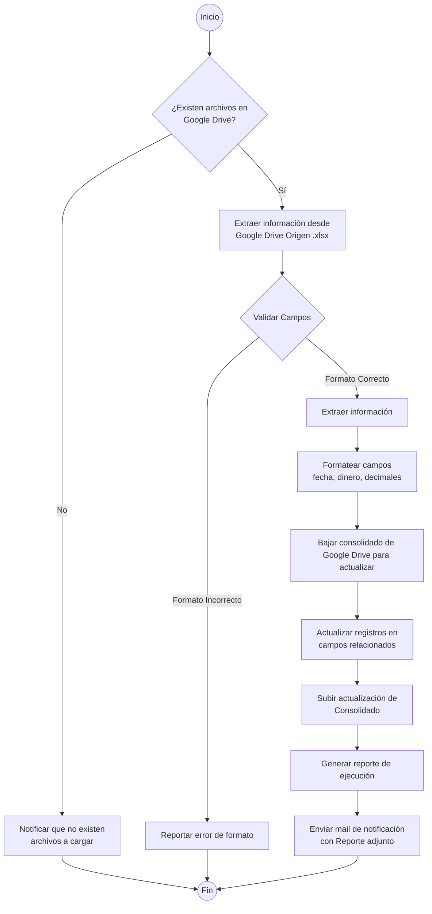

```mermaid
graph TD
    Start((Inicio)) --> CheckFiles{¿Existen archivos en <br>Google Drive?}
    
    %% Flujo si No existen archivos
    CheckFiles -- No --> NotifyNoFiles[Notificar que no existen <br>archivos a cargar]
    NotifyNoFiles --> End((Fin))
    
    %% Flujo si Sí existen archivos
    CheckFiles -- Sí --> ExtractSource[Extraer información desde <br>Google Drive Origen .xlsx]
    ExtractSource --> ValidateFields{Validar Campos}
    
    %% Validación de formato
    ValidateFields -- Formato Incorrecto --> ReportError[Reportar error de formato]
    ReportError --> End
    
    %% Flujo principal
    ValidateFields -- Formato Correcto --> ExtractInfo[Extraer información]
    ExtractInfo --> FormatFields[Formatear campos <br>fecha, dinero, decimales]
    FormatFields --> DownloadConsolidated[Bajar consolidado de <br>Google Drive para actualizar]
    DownloadConsolidated --> UpdateRecords[Actualizar registros en <br>campos relacionados]
    UpdateRecords --> UploadConsolidated[Subir actualización de <br>Consolidado]
    UploadConsolidated --> GenReport[Generar reporte de ejecución]
    GenReport --> SendMail[Enviar mail de notificación <br>con Reporte adjunto]
    SendMail --> End
```